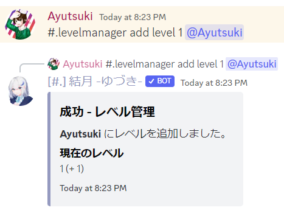
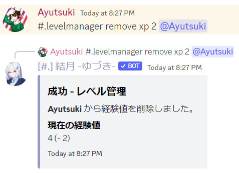

# LevelManager
メンバーのレベル・経験値管理を行います。

!!!warning 注意点
この機能を利用するには、**レベル機能** を有効化する必要があります。
!!!

## 主な使い方
### ユーザーにレベルを 1 付与する

``` コマンドの実行例
#.levelmanager add level 1 @User
```

-

### ユーザーの経験値を 2 削除する
``` コマンドの実行例
#.levelmanager remove xp 2 @User
```

-

## 必要な権限
- ユーザー : サーバーの管理
