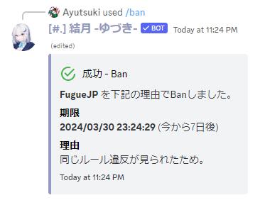

# Ban
指定したメンバーをBanします。

!!!info
このコマンドを利用するには、Bot と実行ユーザーに **`メンバーをBan`** の権限が必要です。
!!!

## 主な使い方
### メンバーを1週間の期限付きでBanする

``` コマンドの実行例
/ban user: @超極悪人 expired: 1w reason: 同じルール違反が見られたため。
```
-

## 有効期限の指定方法

有効期限の設定単位は、以下のものが利用可能です。  
数字と記号を合わせてお使いください。
単位 | 記号 | 例
---  | ---- | ----
秒   | s    | 30s
分   | m    | 5m
時間 | h    | 2h
日   | d    | 3d
週   | w    | 1w

!!!warning 注意
このコマンドは慎重に使用してください。
!!!
