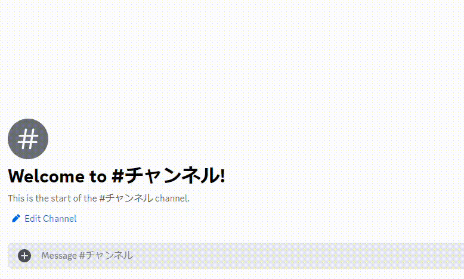

# Kick
指定したメンバーをキックします。

!!!info
このコマンドを利用するには、Bot と実行ユーザーに **`メンバーをキック`** の権限が必要です。
!!!

## 主な使い方
### メンバーをキックする

``` コマンドの実行例
/kick user: @悪い人 reason: 宣伝禁止ルールに違反したため。
```
-

!!!warning 注意
このコマンドは慎重に使用してください。
!!!
