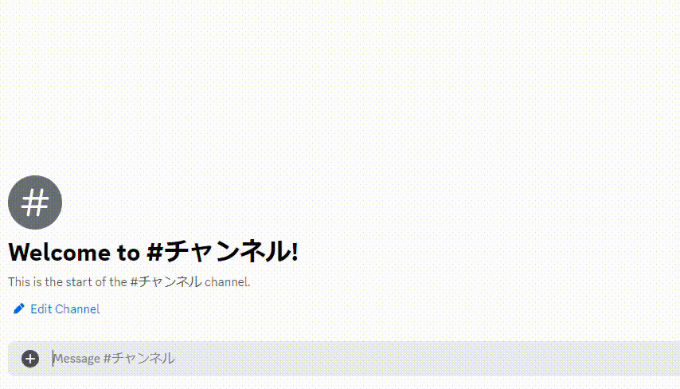

# Mute
指定したメンバーをミュートします。  
ミュートされたメンバーは、「タイムアウト」されます。

!!!info
このコマンドを利用するには、Bot と実行ユーザーに **`メンバーをタイムアウト`** の権限が必要です。
!!!

## 主な使い方
### メンバーを10分ミュートする

``` コマンドの実行例
/mute user: @極悪人 expired: 10m
```

### メンバーを2時間、理由付きでミュートする
``` コマンドの実行例
/mute user: @かわいいBot expired: 2h reason: かわいすぎる。犯罪級
```
-

## 有効期限の指定方法

有効期限の設定単位は、以下のものが利用可能です。  
数字と記号を合わせてお使いください。

単位 | 記号 | 例
---  | ---- | ----
秒   | s    | 30s
分   | m    | 5m
時間 | h    | 2h
日   | d    | 3d
週   | w    | 1w

!!!warning 注意
例ではふざけていますが、このコマンドは慎重に使用してください。
!!!
