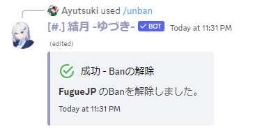

# Unban
指定したユーザーのBanを解除します。

!!!info
このコマンドを利用するには、Bot と実行ユーザーに **`メンバーをBan`** の権限が必要です。
!!!

## 主な使い方
### メンバーのBanを解除する

``` コマンドの実行例
/unban user: @超極悪人
```
-

!!!warning 注意
このコマンドは慎重に使用してください。
!!!
