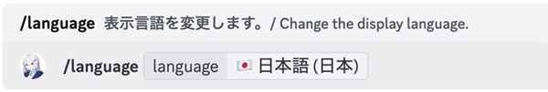
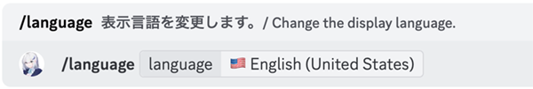
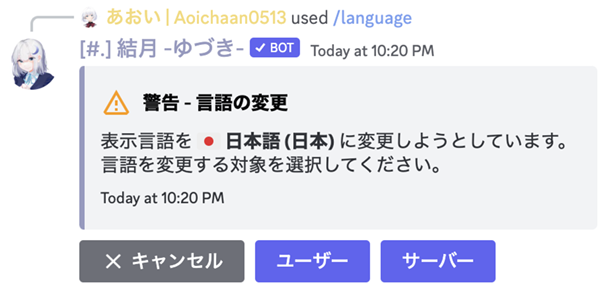
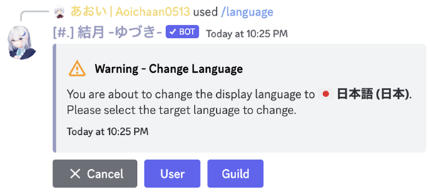
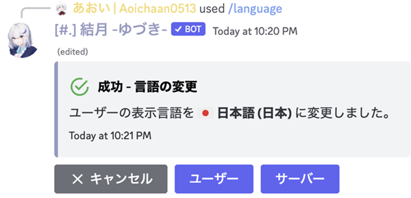
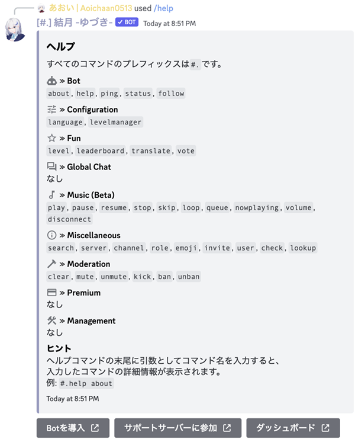

# 表示言語の変え方
Bot のコマンドを実行すると何かしらの表示が行われますが、その際の表示言語を変更する方法を説明します。

!!!info
過去のバージョンでは表示言語の初期設定が英語に設定されていたため、手動で設定を変更していない限りは英語で応答がされています。<br />
そのため、日本語を主に利用する方は以下の方法で表示言語を日本語に変更することをおすすめします。
!!!

## コマンドを実行する
下記のコマンドを実行してください。

``` コマンドの実行例
/language language: 🇯🇵 日本語 (日本)
```

-

==- 表示言語を英語に変更する場合
下記のコマンドを実行してください。<br />
なお、これ以降の操作は共通となります。

``` コマンドの実行例
/language language: 🇺🇸 English (United States)
```

-
===

## 言語を変更する対象を選択する
!!!
下記のいずれかの画像のような表示ではない場合、次の項目に移動してください。
!!!

あなたが**サーバーのオーナー**であるか、**サーバーの管理**権限が付与されている場合は、下記のような表示になります。<br />
その場合は [!button text="ユーザー" size="s"] [!button text="User" size="s"] を押して、あなたの表示言語を変更してください。<br />
※ サーバーの表示言語を変える場合、ここで [!button text="サーバー" size="s"] [!button text="Server" size="s"] を押してください。

-
-

## 適当なコマンドを実行して言語が適用されているかを確かめる
下記の画像のような表示がされたら表示言語の変更は完了となります。

-

試しに `/help` などの適当なコマンドを実行して日本語で表示されるかを確かめましょう。

-
