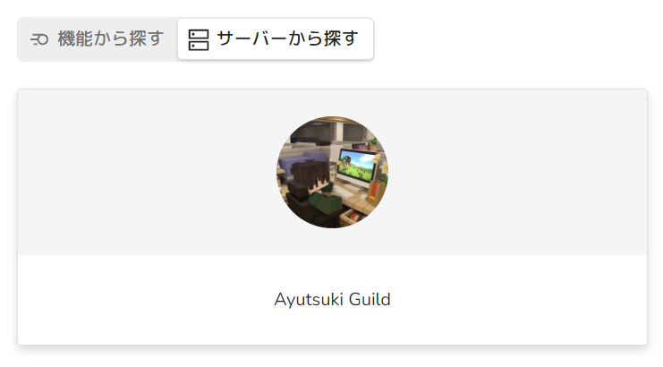
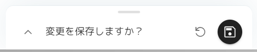

# レベルの変更方法
Bot のレベル機能を用いることでメンバーの発言数に応じた経験値を付与し、サーバーのアクティブ化に役立てることができます。  
このレベル・経験値は、ダッシュボードより変更が可能です。

!!!warning 注意点
この機能を利用するには、**レベル機能** を有効化する必要があります。
!!!

## 1. ダッシュボードにログイン
[https://alpha.lunaproject.jp/](https://alpha.lunaproject.jp/) にアクセスし、Discordアカウントでログインします。  
レベル・経験値を編集するには、サーバーの管理権限が必要です。

## 2. 対象のサーバーを選択
「サーバーから探す」より、目的のサーバーを押下します。
-

## 3. レベルの管理画面に移動
左側メニュー (スマホ等の場合は左上の三本線メニュー) の「機能とオプション」欄より「レベル」を押下します。  

!!!info
この画面で「レベルを有効にする」をONにすることで、レベル機能を有効化できます。
-
!!!

「レベルの管理」を押下すると、ユーザーごとのレベル・経験値を変更できます。

## 4. 保存する
編集が終わりましたら、忘れずに保存ボタンを押してください。
-
